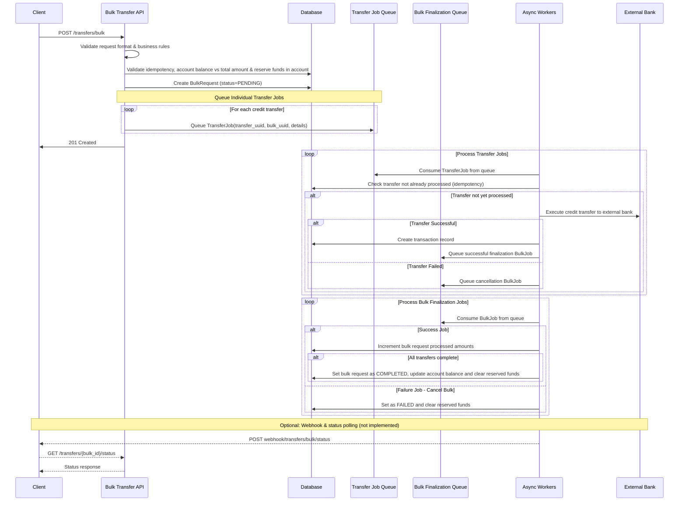

# Bulk Transfer API

A FastAPI-based service for processing bulk credit transfers with asynchronous processing, designed for Qonto's banking platform.

## Overview

This API enables customers to submit up to 1000 credit transfers in a single request, addressing the pain point of processing hundreds of individual transfers (e.g., monthly salary payments). 
The system validates requests synchronously and processes transfers asynchronously.

## Architecture

### Applicative stack

1. [FastAPI](https://fastapi.tiangolo.com/) framework
2. SQLite database
3. In-memory queue using Python `deque` for async processing to simulate a message broker (suitable for MVP, production would use Kafka/RabbitMQ for instance)

### Processing Flow

```
1. POST /transfers/bulk: Synchronous validation
2. Store bulk request in database and reserve account funds
3. Queue individual transfers for sync processing
4. Process each individual transfer
5. Upon completion, each individual transfer queues a job to update the related bulk request status and metadata and finalize the transfer (account balance)
6. Process bulk request finalization job: last successful transfer job or first failing one is responsible for updating the account balance and updating the bulk request final status and metadata
6. (Not implemented) Send a webhook status to a callbak url when the bulk request is completed (failure or success).
```





### Database schema

- bank_accounts: account information with balance and ongoing operations tracking (added `ongoing_transfer_cents` to reserve funds without decreasing the account balance before completion of the request. As a bonus, the amount of ongoing operations is available to be displayed in a UI for instance)
- bulk_requests: bulk operation metadata and status
- transactions: individual transfer records (added `transfer_uuid` for idempotency and link to `bulk_request_uuid`)

> NB: indexes have been added for performance

## Current implementation status

### Implemented features

- Bulk Transfer API: `POST /transfers/bulk` with comprehensive validation and asynchronous transfers processing. 
- Accepts 1000 individual transfers at most.
- All or nothing in this first version: the whole bulk request is cancelled if one individual transfer fails (intermediate milestone). 
- UUID-based idempotency, both at bulk and individual transfer level
- Race conditions handled using account and bulk request locking with `FOR UPDATE` statements
- Domain rules: amount format, account existence, balance checking  
- Account management: funds reservation and atomic account updates
- Financial accuracy: cents-based storage with `Decimal` conversion to prevent from float precision issues
- Error handling: proper HTTP status codes and comprehensive error messages
- Testing: comprehensive test suite with pytest and mocking (75% code coverage)
- Database migrations: light migration system ensuring to run all migrations on server startup

### Gaps

- All or nothing behavior (no partial success): however, the external transfers to remote banks are not reverted for the successful transfers. 
- When a bulk request finalization job can not be processed, there is no reconciliation job to manage the potential successful transfers of this bulk request for instance.

Both points should be discussed, as the goal is rather to support bulk partial failures over all-or-nothing behavior and detect stuck bulk requests.

### Missing features & potential product improvements (non exhaustive list)

- Support partial success: as mentioned above, do not cancel the whole bulk request in case of failed transfers. And failed transfers can be retried depending on the root cause, before considering cancellation.
- Webhooks: no webhook delivery system for bulk request completion notifications
- Bulk request status endpoint: no `GET /transfers/bulk/{bulk_id}/status` polling endpoint (to be returned in the API response for discoverability, and could be used as a fallback in case of webhook deliverability issues or in a live dashboard for instance)
- Input data validation: only basic length checks for BIC/IBAN, no format validation, no call to an external validator service, accounts and organizations validation and verification
- Audit log service consuming transfer operation events
- Transfer scheduling service (execute transfer at a given date)
- Support for other currencies

### Production readiness

There are several improvements to be considered:
- Authentication and authorization: no JWT or API key authentication nor access control implemented
- Database: Sqlite is suitable for this exercise, but for better security and scalability, other RDMS like MySQL or PostgreSQL would be more appropriate.
- Database isolation per organization.
- Retry logic: no retry with exponential backoff for failed transfers for instance (to be implemented on top of a production compatible message broker)
- Monitoring (e.g. Prometheus), alerting (e.g. Prometheus), observability (e.g. Sentry)
- Performance: benchmarks (processing time, throughput, concurrency, memory)
- More structured logging (e.g. JSON based for production tools like Grafana, distributed log files with a universal correlator ID, etc.)
- Rate limiting: no organization-level rate limiting for instance
- Production config: no environment variable management, nor containerization.
  
## Installation & Setup

### Prerequisites

- Python 3.12+
- pip

### Installation (Linux)

```bash
> cd bulk-transfer-api

# Create virtual environment
> python -m venv venv
> source venv/bin/activate

# Install dependencies
> pip install -r requirements.txt
```

### Database Setup

The application automatically runs migrations on startup. The SQLite database will be created at `qonto_accounts.sqlite`.


### Project structure

```
- app/
  - main.py: FastAPI application entry point
  - amounts/
    - converters.py: Monetary conversion domain. 
  - migrations/
    - *.sql: database migration scripts
    - simple_runner.py: light migration scripts runner
  - models/
    - adapter.py: Pydantic schemas for Bulk Request API data validation
    - db.py: SQLModel database schemas and databse access methods
    - job.py: Pydantic schemas for internal queue jobs data validation
  - routers/
    - fake_broker.py: API endpoints for in-memory queue 
    - bulk_transfers.py: API endpoints
  - services/
    - bulk_request_service.py: bulk requests job processing and business logic
    - fake_broker_service.py: fake broker client service
    - transfer_service.py: individual transfers job processing and  business logic
  - utils/
    - log_formatter.py: logger configuration
  - tests/
  - requirements.txt: Python dependencies
  - README.md
```

## Running the Application

### Start the API Server

```bash
> uvicorn app.main:app --reload --host 127.0.0.1 --port 8000
```

The API documentation will be available at:
- OpenAPI Docs: http://127.0.0.1:8000/docs (useful also to test the API)
- ReDoc: http://127.0.0.1:8000/redoc
- Openapi spec: http://127.0.0.1:8000/openapi.json

### Running Tests

```bash
source venv/bin/activate
 
# Run all tests
pytest tests/

# Run specific test file
pytest tests/test_bulk_transfers.py
```

## API Usage

### Submit Bulk Transfer

Create a new bulk transfer request with multiple credit transfers: [documentation](http://127.0.0.1:8000/docs#/Bulk%20Transfers/create_bulk_transfer_transfers_bulk_post) (localhost)

```bash
curl -X POST "http://127.0.0.1:8000/transfers/bulk" \
  -H "Content-Type: application/json" \
  -d '{
    "request_id": "123e4567-e89b-12d3-a456-426614174000",
    "organization_bic": "OIVUSCLQXXX",
    "organization_iban": "FR10474608000002006107XXXXX",
    "credit_transfers": [
      {
        "amount": "100.00",
        "currency": "EUR",
        "counterparty_name": "John Doe",
        "counterparty_bic": "DEUTDEFFXXX",
        "counterparty_iban": "DE89370400440532013000",
        "description": "Salary payment for June 2024"
      }
    ]
      }'
  ```

### Process queued transfers operations (internal endpoints)

Using Postman, the [fastapi localhost doc](http://127.0.0.1:8000/docs) or curl:

```bash
# Process a single transfer from queue
> curl -X GET "http://127.0.0.1:8000/internal/jobs/transfer"

# Process bulk completion from queue  
> curl -X GET "http://127.0.0.1:8000/internal/jobs/bulk"
```

## Approach

### General approach

- Value analysis: problem clarifications, user stories, entities, flows, business rules, technical constraints, trade-offs, error scenarios, edge cases, design
- Milestones & strategy: split project per scope and priority/impact of features. Iterate and reassess. Simplicity and debugging ability during the development phase favored for the sake of exercise (e.g. in-memory queue with API endpoints to control/test the fake broker, simulate failures, synchronous approach easier to implement and test first, then split the "monolith" into services to cut the dependencies and introduce asynchronous processing).
- Code: iterations with testing strategy. Tests and linter checks run automatically in CI pipeline (GitHub Actions).

### Assumptions

- No exchange book rate (only "EUR" currency for bank accounts and transfer operations)
- No processing of transfer operations at a scheduled date
- No more than 2 decimal places
- Only transfer to external bank accounts (no internal transfers between Qonto accounts), neither transfer from an account to same account.

### Critical requirements

- Process transfers asynchronously.
- Ensure idempotency.
- Debit and credit operations should be handled in the same atomic transaction.
- Enforce database transactions by using `Session` to handle proper commit or rollback.
- Race conditions: row locks (select for update).
- Durability: all successful transactions should persist in database.
- Keep transaction short.
- Fault tolerance.

### Domain constraints (Finance)

- Financial accuracy: zero money loss tolerance.
- Ensure no duplicated debit operations.
- Do not accept a bulk request that the account balance should not allow (i.e. the total amount to be transferred is higher than the account balance).
- Audit log: transfer operations should be logged for audit purposes, with timestamps.
- Security and data integrity

### Issues faced

- FastAPI framework ramp-up (FastApi, Pydantic, SQLModel, etc.) in short time
- Pragmatic prioritization of the features and scope in the milestones
- Pragmatic technical choices:
  - Deliverability over test coverage: I applied TDD for the first milestones (basic API, core business logic, synchronous processing), but I had to prioritize the delivery over extensive code coverage in the remaining time after that.
  - Stability over refactoring before the deadline
  - Simplicity and testability/debugging capacity over more realistic environment (e.g. in-memory fake broker) that would require more time to study and setup. 
- Context switches

### Milestones considered

- Milestone 1 (setup, CI pipeline, basic API, database, amounts management): done
- Milestone 2 (core business logic, synchronous processing): done
- Milestone 3 (async processing & idempotency): done
- [optional] Milestone 4 (fault tolerance and status tracking): 10% (partial success, reconciliation events, webhooks missing)
- [optional] Milestone 5 (production concerns): 20% (auth, rate limiting, monitoring missing)
- [optional] Milestone 6 (additional features): 0% (status endpoint, advanced input data validation, etc. missing) 

## Known issues & limitations

### Security Issues

1. No authentication: API is completely open - critical for production
2. No authorization: no access control
3. No rate limiting: vulnerable to abuse
4. No HTTPS enforcement

### Functional Limitations

1. No partial success of a bulk request (all transfers should succeed or nothing)
2. No message broker (in-memory queue): transfers must be manually processed via internal endpoints 
3. No webhooks: no automatic completion notifications 
4. Basic input data validation: IBAN/BIC validation is minimal for instance.

### Technical Debt

1. No reconciliation task when a bulk request can not be finalized.
2. No real message broker with automatic queue processing (in-memory queue with manual job consumption): not suitable for production (can be easily changed in the code). 
3. SQLite database: not suitable for concurrent production load
4. No retry logic: failed operations aren't automatically retried upon failures and crashes (but transfers and bulk requests are already idempotent)
5. Performance: loop several times on the transfers for instance (O(n))
6. Logging: basic logging, needs structured logging for production, consistency 
7. Domain contexts and services responsibilities (refactoring: shorter methods with meaningful method names from the domain, introduce new services based on responsibilities such as account management, service/router split, etc.)
8. Code coverage to be extended 
9. Light database migrations runner (less robust than using a dedicated tool, or tracking the migrations in a table, etc.)
10. Use of deprecated `app.on_event` by simplicity to be able to deliver 
11. No intermediate status to differentiate a job that is created as pending and actually being processed.

### Infrastructure requirements examples

- Database: PostgreSQL or MySQL
- Message queue: Kafka or RabbitMQ for reliable job processing
- Load balancer: for horizontal scaling
- Monitoring & observability: application and infrastructure monitoring

#### Monitoring metrics examples

- Processing rate per minute
- Processing time (time from submission to completion)
- Success rate (bulk request and individual transfers)
- Error rate (by error type, by organization, etc.)
- Processing queue depth (pending transfers)
- Stuck jobs
- User adoption

#### Alerts examples

Operational:
- Processing queue depth: queue size > 1000 transfers for > 5 minutes
- Throughput degradation: processing rate < threshold for > 5 minutes
- Error rate > threshold for > 5 minutes
- Transfers pending > 10 minutes

Financial
- Account balance mismatch
- Bulk requests denied due to insufficient funds 
- High amounts transfer requests and within a short period of time

Third parties:
- External partners error rate > threshold for > 5 minutes
- Database or internal services (authentication, ledger, etc.) error rate > threshold for > 5 minutes
